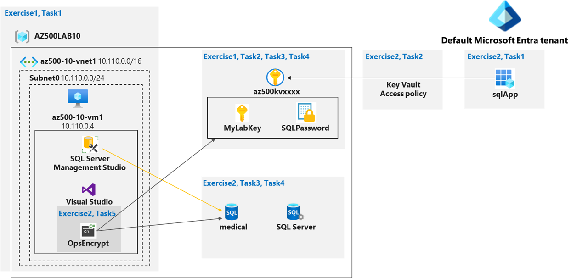

---
lab:
  title: 07 – Key Vault (implémentation de données sécurisées en configurant Always Encrypted)
  module: Module 01 - Implement and manage enforcement of cloud governance policies
---

# Lab 07 : Key Vault (Implémentation de données sécurisées en configurant Always Encrypted)

# Manuel de labo de l’étudiant

## Scénario du labo

Vous avez été invité à créer une application de preuve de concept qui utilise la prise en charge d’Azure SQL Database pour la fonctionnalité Always Encrypted. Les secrets et les clés utilisés dans ce scénario devraient être stockés dans Key Vault. L’application doit être enregistrée dans Microsoft Entra ID afin de renforcer sa sécurité. Pour atteindre ces objectifs, la preuve de concept devrait inclure ce qui suit :

- Création d’un Azure Key Vault et stockage des clés et secrets dans le coffre.
- Créez une base de données SQL Database et un chiffrement du contenu des colonnes de tables de base de données à l’aide d’Always Encrypted.

>**Remarque** : Pour toutes les ressources utilisées dans ce labo, nous utilisons la région **USA Est**. Vérifiez avec votre instructeur qu’il s’agit bien de la région à utiliser pour la classe. 

Pour rester concentré sur les aspects de sécurité d’Azure liés à l’élaboration de cette preuve de concept, vous allez partir d’un déploiement automatisé du modèle ARM, en configurant une machine virtuelle avec Visual Studio 2019 et SQL Server Management Studio 19.

## Objectifs du labo

Dans ce labo, vous allez effectuer les exercices suivants :

- Exercice 1 : Déployer l’infrastructure de base à partir d’un modèle ARM
- Exercice 2 : Configurer les ressource Key Vault avec une clé et un secret
- Exercice 3 : Configurer un base de données Azure SQL et une application pilotée par les données
- Exercice 4 : Montrer l’utilisation d’Azure Key Vault pour le chiffrement de la base de données Azure SQL.

## Diagramme de Key Vault



## Instructions

## Fichiers du labo :

- **\\Allfiles\\Labs\\10\\az-500-10_azuredeploy.json**

- **\\Allfiles\\Labs\\10\\program.cs**

### Durée totale du labo estimée : 60 minutes

### Exercice 1 : Déployer l’infrastructure de base à partir d’un modèle ARM

Dans cet exercice, vous allez effectuer les tâches suivantes :

- Tâche 1 : Déployer une machine virtuelle et une base de données Azure SQL

#### Tâche 1 : Déployer une machine virtuelle et une base de données Azure SQL

Dans cette tâche, vous allez déployer une machine virtuelle Azure qui va installer automatiquement Visual Studio 2019 et SQL Server Management Studio 19 dans le cadre du déploiement. 

1. Connectez-vous au portail Azure **`https://portal.azure.com/`** .

    >**Remarque** : connectez-vous au portail Azure en utilisant un compte disposant du rôle Propriétaire ou Contributeur dans l’abonnement Azure que vous utilisez pour ce labo.

2. Dans le portail Azure, dans la zone de texte **Rechercher des ressources, des services et des documents** en haut de la page, tapez **Déployer un modèle personnalisé**, puis appuyez sur la touche **Entrée**.

3. Dans le volet **Déploiement personnalisé**, sélectionnez **Créer votre propre modèle dans l’éditeur**.

4. Dans le volet **Modifier le modèle**, cliquez sur **Charger le fichier**, recherchez le fichier **\\Allfiles\\Labs\\10\\az-500-10_azuredeploy.json**, puis cliquez sur **Ouvrir**.

5. Dans le volet **Modifier le modèle**, cliquez sur **Enregistrer**.

6. Dans le volet **Déploiement personnalisé**, sous **Étendue du déploiement**, vérifiez que les paramètres suivants sont configurés (conservez les valeurs par défaut pour les autres) :

   |Paramètre|Valeur|
   |---|---|
   |Abonnement|le nom de l’abonnement Azure que vous utilisez dans ce labo|
   |Groupe de ressources|Cliquez sur **Créer** et tapez le nom **AZ500LAB10**.|
   |Emplacement|**USA Est**|
   |Nom d’utilisateur|**Étudiant**|
   |Mot de passe|**Utilisez votre mot de passe personnel créé dans le Labo 02 > Exercice 2 > Tâche 1 > Étape 3.**|
   
    >**Remarque** : bien que vous puissiez modifier les informations d’identification d’administration utilisées pour la connexion à la machine virtuelle, ce n’est pas nécessaire.

    >**Remarque** : pour identifier les régions Azure où vous pouvez approvisionner des machines virtuelles Azure, consultez [ **https://azure.microsoft.com/en-us/regions/offers/** ](https://azure.microsoft.com/en-us/regions/offers/)

8. Cliquez sur le bouton **Vérifier et créer**, puis confirmez le déploiement en cliquant sur le bouton **Créer**. 

    >**Remarque** : cela a pour effet de lancer le déploiement de la machine virtuelle Azure et de la base de données Azure SQL requises pour ce labo. 

    >**Remarque** : n’attendez pas que le déploiement du modèle ARM soit terminé ; passez plutôt à l’exercice suivant. Le déploiement pourrait prendre de **20 à 25 minutes**. 

#### Installez le modèle personnalisé az500-10-DB.json

1. Dans le portail Azure, dans la zone de texte **Rechercher des ressources, des services et des documents** en haut de la page Portail Azure, tapez **Déployer un modèle personnalisé** et appuyez sur la touche **Entrée**.

2. Dans le volet **Déploiement personnalisé**, sélectionnez **Créer votre propre modèle dans l’éditeur**.

3. Dans le volet **Modifier le modèle**, cliquez sur **Charger le fichier**, recherchez le fichier **\Allfiles\Labs\10\az-500-10_DB.json**, puis cliquez sur **Ouvrir**.

4. Assurez-vous que le groupe de ressources correct est sélectionné.

5. Définissez le **mot de passe administrateur** sur le même mot de passe que celui utilisé à l'étape précédente.

### Exercice 2 : Configurer les ressource Key Vault avec une clé et un secret

>**Remarque** : Pour toutes les ressources utilisées dans ce labo, nous utilisons la région **USA Est**. Vérifiez avec votre instructeur qu’il s’agit bien de la région à utiliser pour la classe. 

Dans cet exercice, vous allez effectuer les tâches suivantes :

- Tâche 1 : Créer et configurer un Key Vault
- Tâche 2 : Ajouter une clé au Key Vault
- Tâche 3 : Ajouter un secret au coffre de clés

#### Tâche 1 : Créer et configurer un Key Vault

Dans cette tâche, vous allez créer une ressource Azure Key Vault. Vous allez également configurer les autorisations Azure Key Vault.

1. Ouvrez le Cloud Shell en cliquant sur la première icône (à côté de la barre de recherche) en haut à droite du portail Azure. Si vous y êtes invité, sélectionnez **PowerShell**, puis **Créer un stockage**.

2. Vérifiez que **PowerShell** est sélectionné dans le menu déroulant en haut à gauche du volet Cloud Shell.

3. Dans le volet Cloud Shell, dans la session PowerShell, exécutez la commande suivante pour créer un Azure Key Vault dans le groupe de ressources **AZ500LAB10**. (Si vous avez choisi un autre nom pour le groupe de ressources de ce labo dans le cadre de la Tâche 1, utilisez également ce nom pour cette tâche). Le nom du Key Vault doit être unique : Mémorisez le nom que vous avez choisi, Vous en aurez besoin tout au long de ce labo.  

    ```powershell
    $kvName = 'az500kv' + $(Get-Random)

    $location = (Get-AzResourceGroup -ResourceGroupName 'AZ500LAB10').Location

    New-AzKeyVault -VaultName $kvName -ResourceGroupName 'AZ500LAB10' -Location $location -DisableRbacAuthorization
    ```

    >**Remarque** : la sortie de la dernière commande affiche le nom et l’URI du coffre. L’URI du coffre est au format `https://<vault_name>.vault.azure.net/`.

4. Fermez le volet Cloud Shell. 

5. Dans le portail Azure, dans la zone de texte **Rechercher des ressources, des services et des documents** en haut de la page, tapez **Groupes de ressources**, puis appuyez sur la touche **Entrée**.

6. Dans le volet **Groupes de ressources**, dans la liste du groupe de ressources, cliquez sur l’entrée **AZ500LAB10** (ou un autre nom que vous avez choisi précédemment pour le groupe de ressources).

7. Dans le volet Groupe de ressources, cliquez sur l’entrée représentant le Key Vault nouvellement créé. 

8. Dans le volet Key Vault, dans la section **Paramètres**, cliquez sur **Stratégies d’accès**, puis sur **+ Créer**.

9. Dans le volet **Créer une stratégie d’accès**, spécifiez les paramètres suivants (conservez les valeurs par défaut pour les autres) : 

    |Paramètre|Value|
    |----|----|
    |Configurer à partir d’un modèle (facultatif)|**Gestion des clés, des secrets et des certificats**|
    |Autorisations de clé|Cliquez sur **Sélectionner tout**, ce qui aboutit à la sélection **9 autorisations**|
    |Autorisations de clés/Opérations de chiffrement|Cliquez sur **Se connecter**, ce qui aboutit à la sélection **1 autorisation**|
    |Autorisations de secret|Cliquez sur **Sélectionner tout**, ce qui aboutit à la sélection **7 autorisations**|
    |Autorisations de certification|Cliquez sur **Sélectionner tout**, ce qui aboutit à la sélection **15 autorisations**|
    |Sélectionner le principal|Sur le volet **Principal**, sélectionnez votre compte d’utilisateur, puis cliquez sur **Suivant**|
    |Application (facultatif)|Cliquez sur **Suivant**|
    |Vérifier + créer|Cliquez sur **Créer**|
    
    >**Remarque** : l’opération Vérifier + créer précédente retourne à la page Stratégies d’accès, qui contient les éléments Application, E-mail, Autorisations de clé, Autorisations de secret et Autorisations de certificat.
      
#### Tâche 2 : Ajouter une clé à Key Vault

Dans cette tâche, vous allez ajouter une clé au Key Vault, et afficher les informations relatives à cette clé. 

1. Dans le portail Azure, ouvrez une session PowerShell dans le volet Cloud Shell.

2. Vérifiez que **PowerShell** est sélectionné dans le menu déroulant en haut à gauche du volet Cloud Shell.

3. Dans la session PowerShell dans le volet Cloud Shell, exécutez la commande suivante pour ajouter une clé protégée par logiciel au Key Vault : 

    ```powershell
    $kv = Get-AzKeyVault -ResourceGroupName 'AZ500LAB10'

    $key = Add-AZKeyVaultKey -VaultName $kv.VaultName -Name 'MyLabKey' -Destination 'Software'
    ```

    >**Remarque** : le nom de la clé est **MyLabKey**.

4. Dans le volet Cloud Shell, dans la session PowerShell, exécutez la commande suivante pour vérifier que la clé a été créée :

    ```powershell
    Get-AZKeyVaultKey -VaultName $kv.VaultName
    ```

5. Dans le volet Cloud Shell, dans la session PowerShell, exécutez la commande suivante pour afficher l’identificateur de la clé :

    ```powershell
    $key.key.kid
    ```

6. Réduisez le volet Cloud Shell. 

7. De retour dans le Portail Azure, dans le volet Key Vault, dans la section **Objets**, cliquez sur **Clés**.

8. Dans la liste des clés, cliquez sur l’entrée **MyLabKey**, puis, dans le volet **MyLabKey**, cliquez sur l’entrée représentant la version actuelle de la clé.

    >**Remarque** : examinez les informations relatives à la clé que vous avez créée.

    >**Remarque** : vous pouvez référencer n’importe quelle clé à l’aide de l’identificateur de clé. Pour obtenir la version la plus récente, référencez `https://<key_vault_name>.vault.azure.net/keys/MyLabKey` ou obtenez la version spécifique avec `https://<key_vault_name>.vault.azure.net/keys/MyLabKey/<key_version>`.


#### Tâche 3 : Ajouter un secret à Key Vault

1. Revenez au volet Cloud Shell.

2. Dans le volet Cloud Shell, dans la session PowerShell, exécutez la commande suivante pour créer une variable avec une valeur de chaîne sécurisée :

    ```powershell
    $secretvalue = ConvertTo-SecureString 'Pa55w.rd1234' -AsPlainText -Force
    ```

3.  Dans le volet Cloud Shell, dans la session PowerShell, exécutez la commande suivante pour ajouter le secret au coffre :

    ```powershell
    $secret = Set-AZKeyVaultSecret -VaultName $kv.VaultName -Name 'SQLPassword' -SecretValue $secretvalue
    ```

    >**Remarque** : le nom du secret est Secret. 

4.  Dans le volet Cloud Shell, dans la session PowerShell, exécutez la commande suivante pour vérifier que le secret a été créé :

    ```powershell
    Get-AZKeyVaultSecret -VaultName $kv.VaultName
    ```

5. Réduisez le volet Cloud Shell. 

6. Dans le portail Azure, revenez au volet Key Vault, puis, dans la section **Objets**, cliquez sur **Secrets**.

7. Dans la liste des secrets, cliquez sur l’entrée **SQLPassword**, puis, dans le volet **SQLPassword**, cliquez sur l’entrée correspondant à la version actuelle du secret.

    >**Remarque** : examinez les informations relatives au secret que vous avez créé.

    >**Remarque** : pour obtenir la version la plus récente d’un secret, référencez `https://<key_vault_name>.vault.azure.net/secrets/<secret_name>` ou obtenez une version spécifique avec `https://<key_vault_name>.vault.azure.net/secrets/<secret_name>/<secret_version>`.


### Exercice 3 : Configurer un base de données Azure SQL et une application pilotée par les données

Dans cet exercice, vous allez effectuer les tâches suivantes :

- Tâche 1 : Autoriser votre application cliente à accéder au service Azure SQL Database
- Tâche 2 : Créez une stratégie permettant à l’application d’accéder au Key Vault
- Tâche 3 : Récupérer une chaîne de connexion ADO.NET de base de données SQL Azure 
- Tâche 4 : Connectez-vous à la machine virtuelle Azure qui exécute Visual Studio 2019 et SQL Management Studio 19
- Tâche 5 : Créer une table dans la base de données SQL et sélectionner des colonnes de données pour chiffrement


#### Tâche 1 : Autoriser votre application cliente à accéder au service Azure SQL Database 

Dans cette tâche, vous allez autoriser votre application cliente à accéder au service Azure SQL Database. Vous effectuerez cela en configurant l’authentification requise, et en acquérant l’ID d’application et le secret dont vous aurez besoin pour authentifier votre application.

1. Dans le portail Azure, dans la zone de texte **Rechercher des ressources, des services et des documents** en haut de la page, tapez **Inscriptions d’applications**, puis appuyez sur la touche **Entrée**.

2. Ouvrez le volet **Inscriptions d’applications**, puis cliquez sur **+ Nouvelle inscription**. 

3. Dans le volet **Inscrire une application**, spécifiez les paramètres suivants (conservez les valeurs par défaut pour les autres) :

    |Paramètre|Valeur|
    |----|----|
    |Nom|**sqlApp**|
    |URI de redirection (facultatif)|**Web** et **https://sqlapp**|

4. Dans le volet **Inscrire une application**, cliquez sur **Inscrire**. 

    >**Remarque** : une fois l’inscription terminée, le navigateur vous redirigera automatiquement vers le volet **sqlApp**. 

5. Dans le volet **sqlApp**, identifiez la valeur de l’**ID d’application (client)** . 

    >**Remarque** : Enregistrez cette valeur. Vous en aurez besoin dans la prochaine tâche.

6. Dans le volet **sqlApp**, dans la section **Gérer**, cliquez sur **Certificats et secrets**.

7. Dans le volet **sqlApp | Certificats et secrets**, dans la section **Clés secrètes client**, cliquez sur **+ Nouveau secret client**.

8. Dans le volet **Ajouter un secret client**, spécifiez les paramètres suivants :

    |Paramètre|Valeur|
    |----|----|
    |Description|**Key1**|
    |Expires|**12 mois**|
    
9. Cliquez sur **Ajouter** pour mettre à jour les informations d’identification de l’application.

10. Dans le volet **sqlApp | Certificats et secrets**, identifiez la valeur de **Key1**.

    >**Remarque** : Enregistrez cette valeur. Vous en aurez besoin dans la prochaine tâche. 

    >**Remarque** : *avant* de quitter ce volet, veillez à copier la valeur. En effet, après avoir quitté le volet, il ne sera plus possible de récupérer cette valeur en texte clair.


#### Tâche 2 : Créez une stratégie permettant à l’application d’accéder au Key Vault

Dans cette tâche, vous allez accorder à l’application nouvellement inscrite des autorisations d’accès aux secrets stockés dans le Key Vault.

1. Dans le portail Azure, ouvrez une session PowerShell dans le volet Cloud Shell.

2. Vérifiez que **PowerShell** est sélectionné dans le menu déroulant en haut à gauche du volet Cloud Shell.

3. Dans le volet Cloud Shell, dans la session PowerShell, exécutez la commande suivante pour créer une variable qui stocke l’**ID d’application (client)** que vous avez enregistré dans la tâche précédente (remplacez l’espace réservé `<Azure_AD_Application_ID>` par la valeur de l’**ID d’application (client)** ) :
   
    ```powershell
    $applicationId = '<Azure_AD_Application_ID>'
    ```
4. Dans le volet Cloud Shell, dans la session PowerShell, exécutez la commande suivante pour créer une variable qui stocke le nom du Key Vault :
    ```
    $kvName = (Get-AzKeyVault -ResourceGroupName 'AZ500LAB10').VaultName

    $kvName
    ```

5. Dans le volet Cloud Shell, dans la session PowerShell, exécutez la commende suivante pour accorder des autorisations sur le Key Vault à l’application que vous avez inscrite dans la tâche précédente :

    ```powershell
    Set-AZKeyVaultAccessPolicy -VaultName $kvName -ResourceGroupName AZ500LAB10 -ServicePrincipalName $applicationId -PermissionsToKeys get,wrapKey,unwrapKey,sign,verify,list
    ```

6. Fermez le volet Cloud Shell. 


#### Tâche 3 : Récupérer une chaîne de connexion ADO.NET de base de données SQL Azure 

Le déploiement de modèle ARM dans l’exercice 1 a approvisionné une instance Azure SQL Server et une base de données Azure SQL nommée **medical**. Vous allez mettre à jour la ressource de base de données vide avec une nouvelle structure de table, et sélectionner des colonnes de données pour chiffrement.

1. Dans le portail Azure, dans la zone de texte **Rechercher des ressources, des services et des documents** en haut de la page, tapez **Bases de données SQL**, puis appuyez sur la touche **Entrée**.

2. Dans la liste des bases de données SQL, cliquez sur l’entrée **medical (<randomsqlservername>)** .

    >**Remarque** : si la base de données est introuvable, cela signifie probablement que le déploiement que vous avez lancé dans l’Exercice 1 n’a pas encore été effectué. Vous pouvez vérifier cela en accédant au groupe de ressources Azure « AZ500LAB10 » (ou le nom que vous avez choisi), puis en sélectionnant **Déploiements** dans le volet Paramètres.  

3. Dans le panneau de la base de données SQL, dans la section **Paramètres**, cliquez sur **Chaînes de connexion**. 

    >**Remarque** : l’interface inclut des chaînes de connexion pour ADO.NET, JDBC, ODBC, PHP et Go. 
   
4. Enregistrez la chaîne de connexion **ADO.NET (authentification SQL)** . Vous en aurez besoin ultérieurement.

    >**Remarque** : lorsque vous utilisez la chaîne de connexion, veillez à remplacer l’espace réservé `{your_password}` par le mot de passe que vous avez configuré avec le déploiement dans l’Exercice 1.

#### Tâche 4 : Connectez-vous à la machine virtuelle Azure qui exécute Visual Studio 2019 et SQL Management Studio 19

Dans cette tâche, vous allez vous connecter à la machine virtuelle Azure dont vous avez lancé le déploiement dans l’Exercice 1. Cette machine virtuelle Azure héberge Visual Studio 2019 et SQL Server Management Studio 19.

    >**Note**: Before you proceed with this task, ensure that the deployment you initiated in the first exercise has completed successfully. You can validate this by navigating to the blade of the Azure resource group "Az500Lab10" (or other name you chose) and selecting **Deployments** from the Settings pane.  

1. Dans le portail Azure, dans la zone de texte **Rechercher des ressources, des services et des documents** en haut de la page Portail Azure, tapez **Machines virtuelles**, puis appuyez sur la touche **Entrée**.

2. Dans la liste des machines virtuelles affichée, sélectionnez l’entrée **az500-10-vm1**. Dans le volet **az500-10-vm1**, dans le volet **Essentials**, prenez note de l’**adresse IP publique**. Vous l’utiliserez ultérieurement. 

#### Tâche 5 : Créer une table dans la base de données SQL et sélectionner des colonnes de données pour chiffrement

Dans cette tâche, vous allez vous connecter à SQL Database avec SQL Server Management Studio, puis créer une table. Vous allez ensuite chiffrer deux colonnes de données à l’aide d’une clé générée automatiquement à partir de l’Azure Key Vault. 

1. Dans le portail Azure, accédez au volet de la base de données SQL **medical**. Dans la section **Essentials**, identifiez le **Nom du serveur** (copiez-le dans le Presse-papiers), puis, dans la barre d’outils, cliquez sur **Définir le pare-feu du serveur**.  

    >**Remarque** : enregistrez le nom du serveur. Vous aurez besoin du nom du serveur plus tard dans cette tâche.

2. Dans le panneau **Paramètres du pare-feu**, faites défiler jusqu’à Nom de la règle, cliquez sur **+ Ajouter une règle de pare-feu**, puis spécifiez les paramètres suivants : 

    |Paramètre|Valeur|
    |---|---|
    |Nom de la règle|**Autoriser la machine virtuelle Mgmt**|
    |Adresse IP de début|Adresse IP publique de la machine virtuelle az500-10-vm1.|
    |Adresse IP de fin|Adresse IP publique de la machine virtuelle az500-10-vm1.|

3. Cliquez sur **Enregistrer** pour enregistrer la modification et fermer le volet de confirmation. 

    >**Remarque** : cela a pour effet de modifier les paramètres du pare-feu du serveur, en autorisant les connexions à la base de données medical à partir de l’adresse IP publique de la machine virtuelle Azure que vous avez déployée dans ce labo.

4. Revenez au volet **az500-10-vm1**, cliquez sur **Vue d’ensemble**, puis cliquez sur **Se connecter** et, dans le menu déroulant, cliquez sur **Se connecter**. 

5. Téléchargez le fichier RDP et utilisez-le pour vous connecter à la machine virtuelle Azure **az500-10-vm1** via le Bureau à distance. Lorsque vous êtes invité à vous authentifier, fournissez les informations d’identification suivantes :

    |Paramètre|Valeur|
    |---|---|
    |Nom d’utilisateur|**Étudiant**|
    |Mot de passe|**Utilisez votre mot de passe personnel créé dans le labo 2 > Exercice 1 > Tâche 1 > Étape 9.**|
    
    >**Remarque** : attendez que la session Bureau à distance et le **Gestionnaire de serveur** se chargent. Fermez le gestionnaire de serveurs. 

    >**Remarque** : les étapes restantes de ce labo sont effectuées dans la session Bureau à distance sur la machine virtuelle Azure **az500-10-vm1**.

6. Installez [SQL Server Management Studio](https://learn.microsoft.com/en-us/sql/ssms/download-sql-server-management-studio-ssms?preserve-view=true&view=sql-server-2017) sur **az500-10-vm1**. Machine virtuelle Azure.
 
7. Ouvrez **SQL Server Management Studio**.

8. Dans la boîte de dialogue **Se connecter au serveur**, spécifiez les paramètres suivants : 

    |Paramètre|Valeur|
    |---|---|
    |Type de serveur|**Moteur de base de données**|
    |Nom du serveur|Nom de domaine DNS que vous avez identifié précédemment dans cette tâche.|
    |Authentification|**Authentification SQL Server**|
    |Nom d’utilisateur|**Étudiant**|
    |Mot de passe|**Utilisez votre mot de passe personnel créé dans le Labo 02 > Exercice 2 > Tâche 1 > Étape 3.**|

9. Dans la boîte de dialogue **Se connecter au serveur**, cliquez sur **Se connecter**.

10. Dans le volet **Explorateur d’objets**, ouvrez la console **SQL Server Management Studio**, puis développez le dossier **Base de données**

11. Dans le volet **Explorateur d’objets**, cliquez avec le bouton droit sur la base de données **medical**, puis cliquez sur **Nouvelle requête**.

12. Collez le code suivant dans la fenêtre de requête, puis cliquez sur **Exécuter**. Cela aura pour effet de créer une table **Patients**.

     ```sql
     CREATE TABLE [dbo].[Patients](
        [PatientId] [int] IDENTITY(1,1),
        [SSN] [char](11) NOT NULL,
        [FirstName] [nvarchar](50) NULL,
        [LastName] [nvarchar](50) NULL,
        [MiddleName] [nvarchar](50) NULL,
        [StreetAddress] [nvarchar](50) NULL,
        [City] [nvarchar](50) NULL,
        [ZipCode] [char](5) NULL,
        [State] [char](2) NULL,
        [BirthDate] [date] NOT NULL 
     PRIMARY KEY CLUSTERED ([PatientId] ASC) ON [PRIMARY] );
     ```
13. Une fois la table créée, dans le volet **Explorateur d’objets**, développez le nœud de base de données **medical**, le nœud **tables**, cliquez avec le bouton droit sur le nœud **dbo.Patients**, puis sur **Chiffrer les colonnes**. 

    >**Remarque** : cela aura pour effet d’ouvrir l’Assistant **Always Encrypted**.

14. Dans la page **Introduction**, cliquez sur **Suivant**.

15. Dans la page **Sélection de colonne**, sélectionnez les colonnes **SSN** et **Birthdate**, définissez le **Type de chiffrement** de la colonne **SSN** sur **Déterministe**, et de la colonne **Birthdate** sur **Aléatoire**, puis cliquez sur **Suivant**.

    >**Remarque** : lors du chiffrement, en cas d’erreur telle que **Une exception a été levée par la cible d’un appel** liée à **Rotary (Microsoft.SQLServer.Management.ServiceManagement),** vérifiez que les valeurs de l’**Autorisation de clé** des **Opérations de stratégie de rotation** sont **désactivées**. Si ce n’est pas le cas, dans le portail Azure, accédez à **Key Vault** >> **Stratégies d’accès**  >> **Autorisations de clé** >> Désactivez toutes les valeurs sous les **Opérations de stratégie de rotation** >> Sous **Opérations de clé privilégiées** >> Désactivez **Mise en production**.

16. Dans la page **Configuration de la clé principale**, sélectionnez **Azure Key Vault**, puis cliquez sur **Se connecter**. Lorsque vous y êtes invité, authentifiez-vous à l’aide du compte d’utilisateur que vous avez utilisé pour approvisionner l’instance Azure Key Vault précédemment dans ce labo, assurez-vous que le Key Vault apparaît dans la liste déroulante **Sélectionner un Azure Key Vault**, puis cliquez sur **Suivant**.

17. Dans la page **Paramètres d’exécution**, cliquez sur **Suivant**.
    
18. Dans la page **Résumé**, cliquez sur **Terminer** pour poursuivre le chiffrement. Lorsque vous y êtes invité, reconnectez-vous à l’aide du compte d’utilisateur que vous avez utilisé pour approvisionner l’instance Azure Key Vault précédemment dans ce labo.

19. Une fois le processus de chiffrement terminé, dans la page **Résultats**, cliquez sur **Fermer**.

20. Dans la console **SQL Server Management Studio**, dans le volet **Explorateur d’objets**, sous le nœud **medical**, développez les sous-nœuds **Sécurité** et **Clés Always Encrypted**. 

    >**Remarque** : le sous-nœud **clés Always Encrypted** contient les sous-dossiers **Clés principales de colonne** et **Clés de chiffrement de colonne**.

### Exercice 4 : Montrer l’utilisation d’Azure Key Vault pour le chiffrement de la base de données Azure SQL.

Dans cet exercice, vous allez effectuer les tâches suivantes :

- Tâche 1 : Installez Visual Studio 2022
- Tâche 2 : Exécuter une application pilotées par les données pour montrer l’utilisation d’Azure Key Vault en lien avec le chiffrement de la base de données Azure SQL.

#### Tâche 1 : Installez Visual Studio 2022

1. Passez à votre machine virtuelle serveur si vous n'y êtes pas déjà.

2. Ouvrez le Gestionnaire de serveur.

3. Sélectionnez les serveurs locaux.

4. Désactivez **la configuration de sécurité renforcée** d'**Internet Explorer**.

5. Ouvrez le navigateur et ignorez l'avertissement concernant la désactivation de IE ESC.

6. Accédez à https://visualstudio.microsoft.com/downloads.

7. Dans la case **Visual Studio 2022** , sous **Communauté** , sélectionnez **Téléchargement gratuit**.

8. Une fois le téléchargement terminé, sélectionnez **Ouvrir un fichier**.

9. Sélectionnez Suivant pour poursuivre l’installation.
  - L'installation prend environ 10 minutes

#### Tâche 2 : Exécuter une application pilotées par les données pour montrer l’utilisation d’Azure Key Vault en lien avec le chiffrement de la base de données Azure SQL.

Vous allez créer une application console à l’aide de Visual Studio pour charger des données dans les colonnes chiffrées, puis accéder à ces données en toute sécurité en utilisant une chaîne de connexion qui accède à la clé dans le Key Vault.

1. À partir de la session RDP sur la machine virtuelle **az500-10-vm1**, lancez **Visual Studio 2019** à partir du **menu Démarrer**.

2. Basculez vers la fenêtre affichant le message d’accueil de Visual Studio 2019, cliquez sur le bouton **Se connecter** puis, lorsque vous y êtes invité, entres les informations d’identification que vous avez utilisées pour vous authentifier auprès de l’abonnement Azure que vous utilisez dans ce labo.

3. Dans la page **Prise en main**, cliquez sur **Créer un projet**. 

4. Dans la liste des modèles de projet, recherchez **Application console (.NET Framework)** . Dans la liste des résultats, cliquez sur **Application console (.NET Framework)** pour **C#** , puis sur **Suivant**.

5. Dans la page **Configurer votre nouveau projet**, spécifiez les paramètres suivants (conservez les valeurs par défaut pour les autres), puis cliquez sur **Créer** :

    |Paramètre|Valeur|
    |---|---|
    |Nom du projet|**OpsEncrypt**|
    |Nom de la solution|**OpsEncrypt**|
    |Infrastructure|**.NET Framework 4.7.2**|

6. Dans la console Visual Studio, cliquez sur le menu **Outils**. Dans le menu déroulant, cliquez sur **Gestionnaire de package NuGet**, puis, dans le menu en cascade, cliquez **Console du Gestionnaire de package**.

7. Dans le volet **Console du Gestionnaire de package**, exécutez la commande suivante pour installer le premier package **NuGet** requis:

    ```powershell
    Install-Package Microsoft.SqlServer.Management.AlwaysEncrypted.AzureKeyVaultProvider
    ```

8. Dans le volet **Console du Gestionnaire de package**, exécutez la commande suivante pour installer le deuxième package **NuGet** requis :

    ```powershell
    Install-Package Microsoft.IdentityModel.Clients.ActiveDirectory
    ```
    
9. Réduisez la session RDP à votre machine virtuelle Azure, accédez au fichier **\\Allfiles\\Labs\\10\\program.cs**, ouvrez-le dans Bloc-notes, puis copiez son contenu dans le Presse-papiers.

10. Revenez à la session RDP, puis, dans la fenêtre **Explorateur de solutions** de la console Visual Studio, cliquez sur le fichier **Program.cs** et remplacez son contenu par le code que vous avez copié dans le Presse-papiers.

11. Dans la fenêtre Visual Studio, dans le volet **Program.cs**, à la ligne 15, remplacez l’espace réservé `<connection string noted earlier>` par la chaîne de connexion **ADO.NET** de base de données Azure SQL que vous avez enregistrée précédemment dans le labo. Dans la chaîne de connexion, remplacez l’espace réservé `{your_password}` par le mot de passe que vous avez spécifié dans le déploiement dans l’exercice 1. Si vous avez enregistré la chaîne sur l’ordinateur de labo, il se peut que vous deviez quitter la session RDP pour copier la chaîne ADO, puis revenir à la machine virtuelle Azure pour la coller.

12. Dans la fenêtre Visual Studio, dans le volet **Program.cs**, à la ligne 16, remplacez l’espace réservé `<client id noted earlier>` par la valeur de l’**ID d’application (client)** de l’application inscrite que vous avez enregistrée précédemment dans le labo. 

13. Dans la fenêtre Visual Studio, dans le volet **Program.cs**, à la ligne 17, remplacez l’espace réservé `<key value noted earlier>` par la valeur **Key1** de l’application inscrite que vous avez enregistrée précédemment dans le labo. 

14. Dans la console Visual Studio, cliquez sur le bouton **Démarrer** pour lancer la génération de l’application console et la démarrer.

15. L’application ouvrira une fenêtre d’invite de commandes. Lorsque vous êtes invité à entrer un mot de passe, tapez celui que vous avez spécifié lors du déploiement dans l’Exercice 1 pour vous connecter à Azure SQL Database. 

16. Laissez l’application console d’exécuter, puis basculez vers la console **SQL Management Studio**. 

17. Dans le volet **Explorateur d’objets**, cliquez avec le bouton droit sur la base de données **medical**, puis, dans le menu contextuel, cliquez sur **Nouvelle requête**.

18. Dans la fenêtre de requête, exécutez la requête suivante pour vérifier que les données chargées dans la base de données à partir de l’application console sont chiffrées.

    ```sql
    SELECT FirstName, LastName, SSN, BirthDate FROM Patients;
    ```

19. Revenez à l’application console où vous êtes invité à entrer un SSN valide. Cela aura pour effet d’interroger la colonne chiffrée pour les données. À l’invite de commandes, tapez ce qui suit, puis appuyez sur la touche Entrée :

    ```cmd
    999-99-0003
    ```

    >**Remarque** : vérifiez que les données retournées par la requête ne sont pas chiffrées.

20. Pour arrêter l’application console, appuyez sur la touche Entrée.

**Nettoyer les ressources**

> N’oubliez pas de supprimer toutes les nouvelles ressources Azure que vous n’utilisez plus. La suppression des ressources inutilisées garantit que vous n’encourrez pas de coûts imprévus.

1. Dans le portail Azure, ouvrez le Cloud Shell en cliquant sur la première icône en haut à droite du portail Azure. 

2. Dans le menu déroulant en haut à gauche du volet Cloud Shell, si nécessaire, sélectionnez **PowerShell** puis, à l’invite, cliquez sur **Confirmer**.

3. Dans la session PowerShell dans le volet Cloud Shell, exécutez la commande suivante pour supprimer les groupes de ressources que vous avez créés dans ce labo:
  
    ```powershell
    Remove-AzResourceGroup -Name "AZ500LAB10" -Force -AsJob
    ```

4.  Fermez le volet **Cloud Shell**. 
