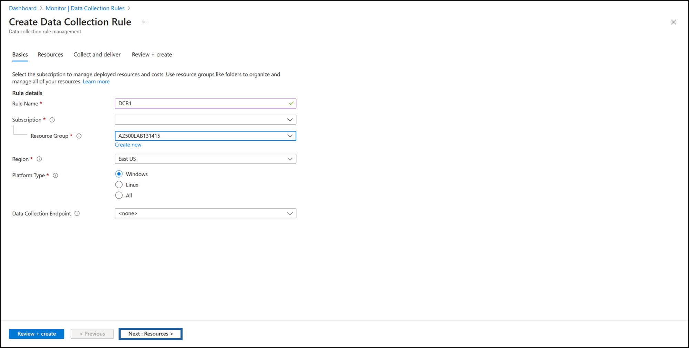
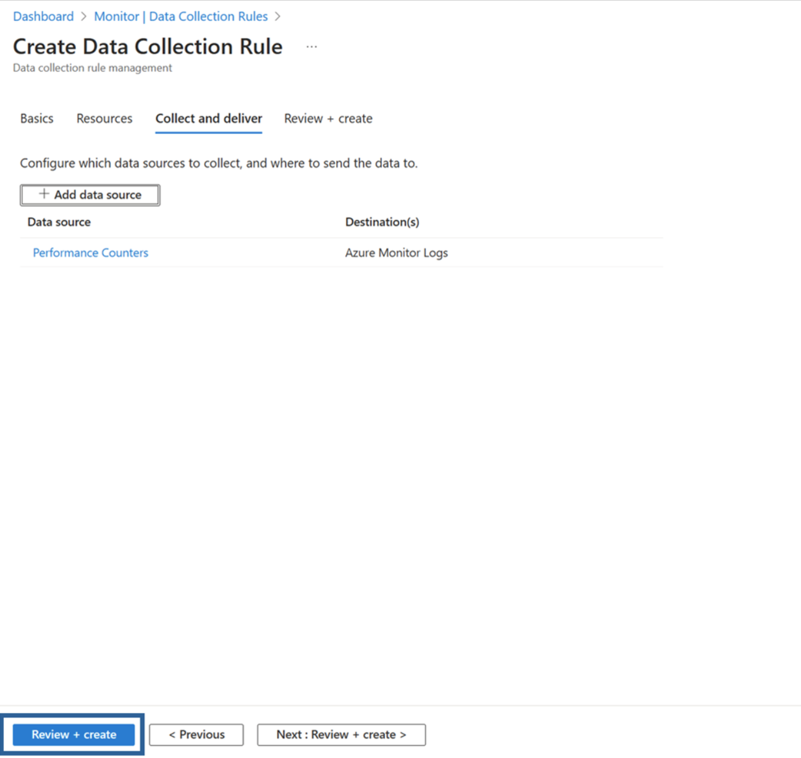

---
lab:
  title: '08 : créer un espace de travail Log Analytics, un compte de stockage Azure et une règle de collecte de données (DCR)'
  module: Module 03 - Configure and manage threat protection by using Microsoft Defender for Cloud
---

# Labo 08 : créer un espace de travail Log Analytics, un compte de stockage Azure et une règle de collecte de données (DCR)

# Manuel de labo de l’étudiant

## Scénario du labo

En tant qu’ingénieur sécurité Azure pour une entreprise de technologie financière, vous êtes chargé d’améliorer la surveillance et la visibilité de la sécurité sur toutes les machines virtuelles Azure utilisées pour traiter les transactions financières et gérer les données client sensibles. L’équipe de sécurité nécessite des journaux détaillés et des indicateurs de performances de ces machines virtuelles pour détecter les menaces potentielles et optimiser les performances du système. Le directeur de la sécurité de l’information (CISO) vous a demandé d’implémenter une solution qui collecte des événements de sécurité, des journaux système et des compteurs de performances. Vous avez été chargé de configurer l’agent Azure Monitor (AMA) ainsi que les règles de collecte de données (DCR) pour centraliser la collecte des journaux et le monitoring des performances.


> Pour toutes les ressources de ce labo, nous utilisons la région **USA Est**. Vérifiez avec votre instructeur qu’il s’agit bien de la région à utiliser. 

## Objectifs du labo

Dans ce labo, vous allez effectuer les exercices suivants :

- Exercice 1 : Déployer une machine virtuelle Azure
- Exercice 2 : Créer un espace de travail Log Analytics
- Exercice 3 : Créer un compte de stockage Azure
- Exercice 4 : créer une règle de collecte de données
  
## Instructions

### Exercice 1 : Déployer une machine virtuelle Azure

### Durée de l’exercice : 10 minutes

Dans cet exercice, vous allez effectuer les tâches suivantes : 

#### Tâche 1 : Déployer une machine virtuelle Azure

1. Connectez-vous au portail Azure **`https://portal.azure.com/`** .

    >**Remarque** : connectez-vous au Portail Azure à l’aide d’un compte disposant du rôle Propriétaire ou Contributeur dans l’abonnement Azure que vous utilisez pour ce laboratoire.

2. Ouvrez Cloud Shell en cliquant sur la première icône située en haut à droite du portail Azure. Si vous y êtes invité, sélectionnez **PowerShell**.

3. Vérifiez que **PowerShell** est sélectionné dans le menu déroulant en haut à gauche du volet Cloud Shell.

4. Dans la **Prise en main**, laissez le paramètre par défaut tel quel : **Sélectionnez un abonnement pour commencer. Vous pouvez éventuellement monter un compte de stockage pour conserver les fichiers entre les sessions. Aucun compte de stockage requis.**

5. Dans le menu déroulant **Abonnement**, sélectionnez votre **lodsubscription**

6. Laissez l’option **Utiliser un réseau virtuel privé existant** décochée, puis cliquez sur **Appliquer**.

7. Dans la session PowerShell du volet Cloud Shell, exécutez la commande suivante pour supprimer un groupe de ressources que vous avez utilisé dans ce labo :
  
    ```powershell
    New-AzResourceGroup -Name AZ500LAB131415 -Location 'EastUS'
    ```

    >**Remarque** : ce groupe de ressources sera utilisé pour les labos 8, 9 et 10.

8. Dans le volet Cloud Shell, dans la session PowerShell, exécutez la commande suivante pour activer le chiffrement sur l’hôte (EAH).
   
   ```powershell
    Register-AzProviderFeature -FeatureName "EncryptionAtHost" -ProviderNamespace Microsoft.Compute 
    ```

5. Dans la session PowerShell du volet Cloud Shell, exécutez la commande suivante pour créer une nouvelle machine virtuelle Azure. 

    ```powershell
    New-AzVm -ResourceGroupName "AZ500LAB131415" -Name "myVM" -Location 'EastUS' -VirtualNetworkName "myVnet" -SubnetName "mySubnet" -SecurityGroupName   "myNetworkSecurityGroup" -PublicIpAddressName "myPublicIpAddress" -PublicIpSku Standard -OpenPorts 80,3389 -Size Standard_D2s_v3 
    ```
    
6.  Lorsque vous êtes invité des informations d'identification:

    |Paramètre|Valeur|
    |---|---|
    |Utilisateur |**localadmin**|
    |Mot de passe|**Utilisez votre mot de passe personnel créé dans le labo 02 > Exercice 2 > Tâche 1 > Étape 3.**|

    >**Remarque** : Attendez la fin du déploiement. 

7. Dans la session PowerShell du volet Cloud Shell, exécutez ce qui suit pour vérifier que la machine virtuelle nommée **myVM** a été créée et que son **ProvisioningState** est **Réussi**.

    ```powershell
    Get-AzVM -Name 'myVM' -ResourceGroupName 'AZ500LAB131415' | Format-Table
    ```

8. Fermez le volet Cloud Shell. 

### Exercice 2 : Créer un espace de travail Log Analytics

### Durée de l’exercice : 10 minutes

Dans cet exercice, vous allez effectuer les tâches suivantes : 

#### Tâche 1 : Créer un espace de travail Log Analytics

Dans cette tâche, vous allez créer un espace de travail Log Analytics. 

1. Dans le portail Azure, dans la zone de texte **Rechercher des ressources, des services et des documents** en haut de la page, tapez **Espaces de travail Log Analytics**, puis appuyez sur la touche **Entrée**.

2. Dans le volet **Espaces de travail Log Analytics**, cliquez sur  **+ Créer**.

3. Sous l’onglet **Informations de base** du volet **Créer un espace de travail Log Analytics**, spécifiez les paramètres suivants (laissez les valeurs par défaut des autres paramètres) :

    |Paramètre|Valeur|
    |---|---|
    |Abonnement|le nom de l’abonnement Azure que vous utilisez dans ce labo|
    |Resource group|**AZ500LAB131415**|
    |Nom|n’importe quel nom unique valide et global|
    |Région|**USA Est**|

4. Sélectionnez **Revoir + créer**.

5. Dans l’onglet **Vérifier + créer** du volet **Créer un espace de travail Log Analytics**, sélectionnez **Créer**.

### Exercice 3 : Créer un compte de stockage Azure

### Durée estimée : 10 minutes

Dans cet exercice, vous allez effectuer les tâches suivantes :

#### Tâche 1 : Créer un compte de stockage Azure

Dans cette tâche, vous allez créer un compte de stockage.

1. Dans le portail Azure, dans la zone de texte **Rechercher des ressources, des services et des documents** située en haut de la page, tapez **Comptes de stockage**, puis appuyez sur la touche **Entrée**.

2. Dans le panneau **Comptes de stockage** du portail Azure, cliquez sur le bouton **+ Créer** pour créer un compte de stockage.

3. Sous l’onglet **Options de base** du volet **Créer un compte de stockage**, spécifiez les paramètres suivants (conservez les valeurs par défaut pour les autres) :

    |Paramètre|Valeur|
    |---|---|
    |Abonnement|le nom de l’abonnement Azure que vous utilisez dans ce labo|
    |Resource group|**AZ500LAB131415**|
    **Détails de l’instance** |Nom du compte de stockage : tout nom globalement unique, entre 3 et 24 caractères, composé de lettres et de chiffres| |Région| **(États-Unis) USA Est**|
    |Service principal|**Stockage Blob Azure ou Azure Data Lake Storage Gen 2**|
    |Performances| **Standard (compte polyvalent v2)**|
    |Redondance| **Stockage localement redondant (LRS)**|

5. Dans l’onglet **Informations de base** du panneau **Créer un compte de stockage**, cliquez sur **Examiner et créer**. Une fois le processus de validation terminé, cliquez sur **Créer**.

    >**Remarque** : attendez que le compte de stockage soit créé. Ce processus prend environ 2 minutes.

### Exercice 4 : créer une règle de collecte de données

### Durée estimée : 15 minutes

Dans cet exercice, vous allez effectuer les tâches suivantes :

#### Tâche 1 : Créez une règle de collecte de données.

Dans cette tâche, vous allez créer une règle de collecte de données.

1. Dans le portail Azure, dans la zone de texte **Rechercher des ressources, des services et des documents** en haut de la page, tapez **Surveillance**, puis appuyez sur la touche **Entrée**.

2. Dans le volet **Paramètres**, cliquez sur **Règles de collecte de données**.

3. Cliquez sur **+Créer** pour créer une règle de collecte de données.

4. Sous l’onglet **Informations de base** du volet **Créer une règle de collecte de données**, spécifiez les paramètres suivants :
  
    |Paramètre|Valeur|
    |---|---|
    **Détails de la règle** |Nom de la règle| **DCR1**|
    |Abonnement|le nom de l’abonnement Azure utilisé dans ce labo| |Groupe de ressources|**AZ500LAB131415**|
    |Région|**USA Est**|
    |Type de plateforme|**Windows**|
    |Point de terminaison de collecte de données|*Laisser vide*|

    


5. Cliquez sur le bouton étiqueté **Suivant : Ressources >** pour continuer.
   
6. Sur la page **Ressources**, sélectionnez **+ Ajouter des ressources**.

7. Dans le modèle **Sélectionner une étendue**, cochez la case **Abonnement** dans l’**Étendue**.

8. En bas du modèle **Sélectionner une étendue**, cliquez sur **Appliquer**.

9. En bas de la page **Ressources**, sélectionnez **Suivant : Collecter et remettre >**.

10. Cliquez sur **+ Ajouter une source de données**, puis dans la page **Ajouter une source de données**, modifiez le menu déroulant **Type de source de données** pour afficher **Compteurs de performances**. Laissez les paramètres par défaut suivants :

    |Paramètre|Valeur|
    |---|---|
    |**Compteur de performances**|**Taux d’échantillonnage (secondes)**|
    |UC|60|
    |Mémoire|60|
    |Disque|60|
    |Réseau|60|

   

11. Cliquez sur le bouton étiqueté **Suivant : Destination >** pour continuer.
  
12. Cliquez sur **+Ajouter une destination**, modifiez le menu déroulant **Type de destination** pour afficher **Journaux d’activité Azure Monitor**. Dans la fenêtre **Abonnement**, vérifiez que votre *abonnement* est affiché, puis modifiez le menu déroulant **Compte ou espace de noms** pour refléter votre espace de travail Log Analytics créé précédemment.

13. Cliquez sur **Ajouter une source de données** en bas de la page.
    
    

14. Cliquez sur **Vérifier + créer**.

    

15. Cliquez sur **Créer**.

> Résultats : Vous avez déployé une machine virtuelle Azure, un espace de travail Log Analytics, un compte de stockage Azure et une règle de collecte de données pour collecter les événements et les compteurs de performances à partir de machines virtuelles avec l’agent Azure Monitor.

>**Note** : ne supprimez pas les ressources de ce labo, car elles sont nécessaires pour le labo Microsoft Defender pour le cloud et le labo Microsoft Sentinel.
 
