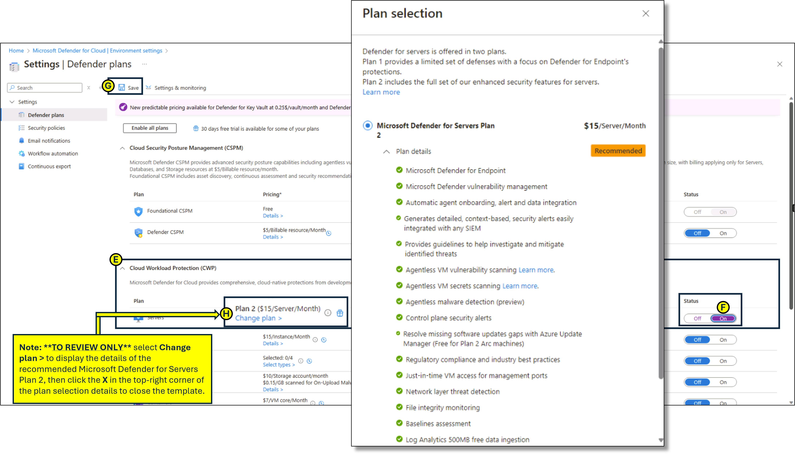

---
lab:
  title: 09 - Configuration des fonctionnalités de sécurité renforcée de Microsoft Defender for Cloud pour les serveurs
  module: Module 03 - Configure and manage threat protection by using Microsoft Defender for Cloud
---

# Labo 09 : configuration des fonctionnalités de sécurité renforcée de Microsoft Defender for Cloud pour les serveurs

# Manuel de labo de l’étudiant

## Scénario du labo

En tant qu’ingénieur sécurité Azure pour une entreprise internationale de e-commerce, vous êtes responsable de la sécurisation de l’infrastructure cloud de l’entreprise. L’organisation s’appuie fortement sur des machines virtuelles Azure et des serveurs locaux pour exécuter des applications critiques, gérer les données client et traiter les transactions. Le directeur de la sécurité de l’information (CISO) a identifié la nécessité de mesures de sécurité renforcées pour protéger ces ressources contre les cybermenaces, les vulnérabilités et les mauvaises configurations. Vous avez été chargé d’activer Microsoft Defender pour serveurs dans Microsoft Defender for Cloud pour fournir une protection avancée contre les menaces et une surveillance de la sécurité pour les machines virtuelles Azure et les serveurs hybrides.

## Objectifs du labo

- Configurer les fonctionnalités de sécurité renforcée de Microsoft Defender pour le cloud pour les serveurs
  
- Passer en revue les fonctionnalités de sécurité renforcée pour le Plan 2 de Microsoft Defender pour serveurs

## Instructions de l’exercice

### Configurer les fonctionnalités de sécurité renforcée de Microsoft Defender pour le cloud pour les serveurs

1. Dans le portail Azure, dans la zone de texte Rechercher des ressources, des services et des documents située en haut de la page du portail Azure, saisissez **Microsoft Defender pour le cloud** et appuyez sur la touche **Entrée**.

2. Dans **Microsoft Defender pour le cloud**, dans le **panneau de gestion**, accédez aux **paramètres d’environnement**. Développez les dossiers des paramètres d’environnement jusqu’à ce que la section **abonnement** s’affiche, puis cliquez sur l’**abonnement** pour afficher les détails.

   
   
3. Dans le panneau **Paramètres**, sous **plans Defender**, développez **Protection de la charge de travail du cloud**.

4. Dans la liste **Plan de protection de charge de la charge de travail du cloud**, sélectionnez **Serveurs**. À droite de la page, remplacez le **Statut****Désactivé** par **Activé**, puis cliquez sur **Enregistrer.**

5. Pour passer en revue les détails du **Plan 2 de Microsoft Defender pour serveurs**, sélectionnez **Modifier le plan >**.

   Remarque : l’activation du plan Serveurs de la Protection de la charge de travail du cloud active également le Plan 2 de Microsoft Defender pour serveurs.
 
   
   
> **Résultats** : vous avez activé le Plan 2 de Microsoft Defender pour serveurs pour votre abonnement.
